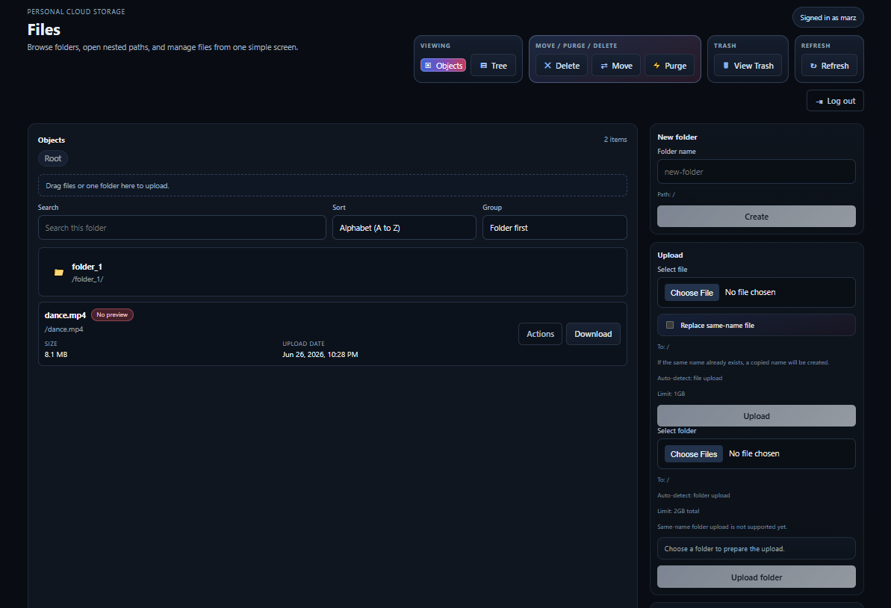
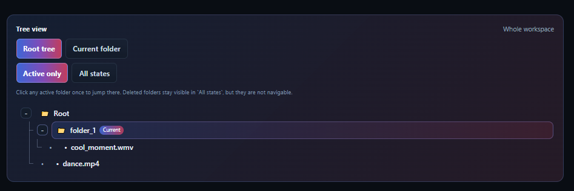

# PCS

## 1. About PCS

PCS is a personal cloud storage website built on AWS.

It helps you keep your own files in a simple web app where you can:
- upload files and folders
- organize them in folders
- preview common file types
- move, rename, delete, and restore items
- manage your own storage without depending on a public consumer cloud product

PCS is aimed at people who want a practical personal storage app first, with room to extend it later.

## 2. Features

- Storage management
  - Upload files and folders
  - Browse files and folders in folder and tree view
  - Soft and hard delete files
  - Restore files from trash
  - Move folders
  - Purge folders

- User experience
  - Drag and drop upload
  - Upload progress tracking for file and folder upload
  - File preview for common formats

## 3. Demo Screenshot

## 4. AWS Tech

- AWS ECS: runs the containerized frontend and backend services.
- AWS ECR: stores Docker images used by ECS deployment.
- AWS S3: stores files and folder placeholder objects / environment file.
- AWS DynamoDB: stores user data, file metadata, folder metadata, and operation logs.

## 5. System Architecture

Design decision: the current deployment uses HTTP because PCS is intended as a small personal project shared between me and a friend.

## 6. For People Who Want To Fork It

This project is a good base if you want to build your own version of PCS with:
- a different UI
- stronger sharing features
- better recovery and cleanup flows
- richer preview support
- a different authentication model

Notable paths:
- `backend/app/storage_backend.py`: FastAPI route definitions and request models.
- `backend/app/services/object_storage_service.py`: main storage workflow logic for upload, download, folder upload, move, purge, trash, and preview.
- `backend/app/config.py`: backend environment/config loading.
- `backend/app/resource_guard.py`: shared AWS resource availability checks.
- `backend/app/auth_router.py`: login and authentication routes.
- `frontend/src/App.jsx`: main frontend state and workflow coordination.
- `frontend/src/components/`: reusable React UI components.
- `frontend/src/styles.css`: main frontend styling.
- `frontend/nginx/default.conf`: Nginx config for serving the frontend and proxying API requests.
- `docker-compose.yml`: local container setup for frontend and backend.
- `scripts/`: maintenance and integrity-check scripts.

## 7. Future Work

- Better recovery and cleanup flows for failed operations
- More robust file preview support
- Stronger deployment and release workflows
- Better sharing or collaboration features
- More polished storage management UX
